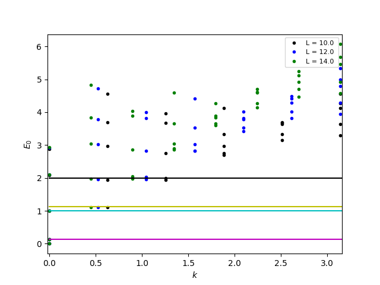

### Introduction

In this tutorial, we will look at critical spin chains and make a connection to their description in terms of conformal field theory.

The model we will consider is the critical Ising chain, given by the Hamiltonian

$$
H=J_{z} \sum_{\langle i,j \rangle} S^i_z S^j_z + \Gamma \sum_i S^i_x
$$

Here, the first sum runs over pairs of nearest neighbours. $\Gamma$ is referred to as transverse field; the system becomes critical for $\Gamma/J=\frac{1}{2}$. For $\Gamma=0$, the ground state is antiferromagnetic for $J\gt 0$ and ferromagnetic for $J \lt 0$. The system is exactly solvable ([P. Pfeuty, Annals of Physics: 57, 79-90 (1970)](https://www.sciencedirect.com/science/article/abs/pii/0003491670902708?via%3Dihub)).

In the above equation, $\Delta$ refers to the scaling dimension of that field. The scaling fields occur in groups: the lowest one, referred to as primary field, comes with an infinite number of descendants with scaling dimension $\Delta + m$, $m \in \lbrace 1, 2, 3, ... \rbrace$.

In the exact solution of the Ising model (Eq. (3.7) in [the paper P. Pfeuty](https://www.sciencedirect.com/science/article/abs/pii/0003491670902708?via%3Dihub)), the long-range correlations are found to decay as:
$$
\langle S^i_z S^{i+n}\_z \rangle \sim n^{-2\times 1/8}
$$
$$
\langle S^i_y S^{i+n}\_y \rangle \sim n^{-2\times(1+1/8)}
$$
$$
\langle S^i_x S^{i+n}\_x \rangle \sim n^{-2\times 1}
$$
Additionally, we expect the scaling dimension of the identity operator to be 0.

We therefore expect scaling dimensions of 0, 1/8, 1, 1+1/8 to appear in the CFT of the Ising model. To see this, we will rescale all energies of the spectrum according to $E \rightarrow \frac{E-E_0}{(E_1-E_0)8}$. This will force the two lowest states to occur where we expect the scaling dimensions; we can then check whether the rest of the spectrum is consistent with this.


### Simulation

We will first import some modules:


```python
import pyalps
import pyalps.plot
import numpy as np
import matplotlib.pyplot as plt
import copy
import math
```

Then, let us set up the parameters for two system sizes. Be careful to use the transverse field $\Gamma$, not the longitudinal field $h$.


```python
# Some general parameters with different lattice sizes:
parms = []
for L in [10,12]:
    parms.append({
        'LATTICE'    : "chain lattice",
        'MODEL'      : "spin",
        'local_S'    : 0.5,
        'Jxy'        : 0,
        'Jz'         : -1,
        'Gamma'      : 0.5,
        'NUMBER_EIGENVALUES' : 5,
        'L'          : L
    })

```

As you can see, we will simulate two system sizes. Now let's set up the input files and run the simulation:


```python
prefix = 'ising'
input_file = pyalps.writeInputFiles(prefix,parms)
res = pyalps.runApplication('sparsediag', input_file)
# res = pyalps.runApplication('sparsediag', input_file, MPI=2, mpirun='mpirun')
data = pyalps.loadEigenstateMeasurements(pyalps.getResultFiles(prefix=prefix))
```


To perform CFT assignments, we need to calculate the ground state and the first excited state for each L.
The output of the above load operation will be a hierarchical list sorted by L, so we can just iterate through it


```python
E0 = {}
E1 = {}
for Lsets in data:
    L = pyalps.flatten(Lsets)[0].props['L']
    # Make a big list of all energy values
    allE = []
    for q in pyalps.flatten(Lsets):
        allE += list(q.y)
    allE = np.sort(allE)
    E0[L] = allE[0]
    E1[L] = allE[1]
```

Subtract E0, divide by gap, multiply by 1/8, which we know to be the smallest non-vanishing scaling dimension of the Ising CFT


```python
for q in pyalps.flatten(data):
    L = q.props['L']
    q.y = (q.y-E0[L])/(E1[L]-E0[L]) * (1./8.)

spectrum = pyalps.collectXY(data, 'TOTAL_MOMENTUM', 'Energy', foreach=['L'])
```

Plot the first few exactly known scaling dimensions


```python
for SD in [0.125, 1, 1+0.125, 2]:
    d = pyalps.DataSet()
    d.x = np.array([0,4])
    d.y = SD+0*d.x
    # d.props['label'] = str(SD)
    spectrum += [d]

pyalps.plot.plot(spectrum)

plt.legend(prop={'size':8})
plt.xlabel("$k$")
plt.ylabel("$E_0$")

plt.xlim(-0.02, math.pi+0.02)

plt.show()

```

The result of the simulation is shown in the figure:

