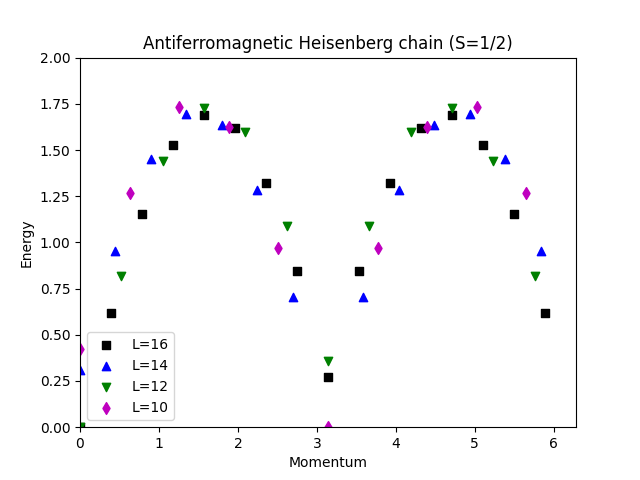
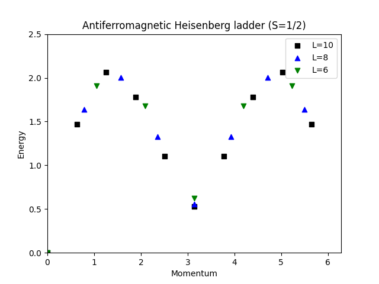
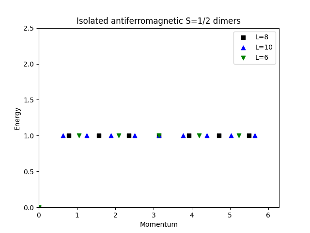

In this tutorial we will calculate the energy spectra of the quantum Heisenberg model on various 1D lattices. The main work will be done by the `sparsediag` application, which implements the Lanczos algorithm, an iterative eigensolver, to obtain energies in different momentum sectors. The collected data will be plotted to show the energy-momentum spectra of 1D quantum Heisenberg model on various 1D lattices.

### Heisenberg Chain

#### Introduction

The Hamiltonian for the spin-1/2 Heisenberg chain is given by 
$$H = J\sum_{\langle i,j \rangle} \mathbf{S}^i \cdot \mathbf{S}^j$$,
where $J>0$ for antiferromagnetic interactions between two nearest-neighbour spins $\mathbf{S}^i$ and $\mathbf{S}^j$, and the spin-spin interaction consists of three components, i.e., 
$$\mathbf{S}^i \cdot \mathbf{S}^j=S^i_xS^j_x+S^i_yS^j_y+S^i_zS^j_z$$.

The basis states are usually chosen to be the eigen states of $S_z$ operator. For a spin-1/2 system, there are two basis states for each lattice site, $|-1/2\rangle$ and $|+1/2\rangle$. The application of $S_x$ and $S_y$ operators on these basis states can be expressed in terms of raising $S^{\dagger}$ and lowering $S^{-}$ operators:
$$S_x=\frac{1}{2}(S^{\dagger}+S^{-})$$,
$$S_y=\frac{1}{2i}(S^{\dagger}-S^{-})$$, 
who act on the basis states in the following way:
$$S^{\dagger}|s\rangle = \sqrt{S(S+1)-s(s+1)}|s+1\rangle$$,
$$S^{-}|s\rangle = \sqrt{S(S+1)-s(s-1)}|s-1\rangle$$,
where $S=1/2$ and $s=-1/2, 1/2$.

With the above basis states for each lattice site, the Hamiltonian can be written as a Hermitian matrix. The size of the matrix can be reduced when the total magnetization is fixed, i.e., setting Sz_total = 0 (singlet sector) or Sz_total = 1 (triplet sector) in the simulations. To further reduce the size of the Hamiltonian matrix and obtain the momentum dependence of the energy spectra, we can further restrict the simulations in different lattice momentum sectors $P=0, 1, 2, \cdots$. 


#### Simulation

To obtain the energy spectrum for the Heisenberg chain, we follow the steps below.

We first import the required modules.


```python
import pyalps
import numpy as np
import matplotlib as plt
import pyalps.plot
```

Prepare the input parameters for 4 different lattice sizes: $L=10, 12, 14$, and $16$.


```python
parms=[]
for l in [10, 12, 14, 16]:
    parms.append(
      { 
        'LATTICE'                   : "chain lattice", 
        'MODEL'                     : "spin",
        'local_S'                   : 0.5,
        'J'                         : 1,
        'L'                         : l,
        'CONSERVED_QUANTUMNUMBERS'  : 'Sz',
        'Sz_total'                  : 0
      }
    )
```

Write the input file and run the simulation.


```python
input_file = pyalps.writeInputFiles('parm_chain',parms)
res = pyalps.runApplication('sparsediag',input_file)
```


Load all measurements for all states, and collect spectra over all momenta for every simulation.


```python
data = pyalps.loadSpectra(pyalps.getResultFiles(prefix='parm_chain'))

spectra = {}
for sim in data:
  l = int(sim[0].props['L'])
  all_energies = []
  spectrum = pyalps.DataSet()
  for sec in sim:
    all_energies += list(sec.y)
    spectrum.x = np.concatenate((spectrum.x,np.array([sec.props['TOTAL_MOMENTUM'] for i in range(len(sec.y))])))
    spectrum.y = np.concatenate((spectrum.y,sec.y))
  spectrum.y -= np.min(all_energies)
  spectrum.props['line'] = 'scatter'
  spectrum.props['label'] = 'L='+str(l)
  spectra[l] = spectrum
```

Plot the energy vs. momentum spectrum.


```python
plt.pyplot.figure()
pyalps.plot.plot(spectra.values())
plt.pyplot.legend()
plt.pyplot.title('Antiferromagnetic Heisenberg chain (S=1/2)')
plt.pyplot.ylabel('Energy')
plt.pyplot.xlabel('Momentum')
plt.pyplot.xlim(0,2*3.1416)
plt.pyplot.ylim(0,2)
plt.pyplot.show()

```

Below is the energy spectrum for a 1D Heisenberg chain:


### Two-leg Heisenberg Ladder

#### Introduction

The Hamiltonian for the two-leg spin-1/2 Heisenberg chain is given by 
$$H = J_0\sum_{\langle \alpha i,\alpha j \rangle} \mathbf{S}^{\alpha i} \cdot \mathbf{S}^{\alpha j} + J_1\sum_{\langle 1 i,2 i \rangle} \mathbf{S}^{1 i} \cdot \mathbf{S}^{2 i}$$,
where, $\alpha=1,2$ denotes the two legs/chains, $i,j=1,2,\cdots,L$ label lattice sites within a chain, $J_0>0$ is the intra-chain antiferromagnetic interactions between two nearest-neighbour spins $\mathbf{S}^{\alpha i}$ and $\mathbf{S}^{\alpha j}$ in the same chain, and $J_1>0$ is the inter-chain spin-spin coupling between $\mathbf{S}^{1 i}$ from the first leg and $\mathbf{S}^{2 i}$ from the second leg with $i=1,2,\cdots,L$. 

#### Simulation

We first import the required modules.


```python
import pyalps
import numpy as np
import matplotlib as plt
import pyalps.plot
```

Prepare the input parameters by setting values for the intra- and inter-chain interactions J0 and J1, and the chain lengths L=6,8, and 10.


```python
parms=[]
for l in [6, 8, 10]:
    parms.append(
      { 
        'LATTICE'                   : "ladder", 
        'MODEL'                     : "spin",
        'local_S'                   : 0.5,
        'J0'                        : 1,
        'J1'                        : 1,
        'L'                         : l,
        'CONSERVED_QUANTUMNUMBERS'  : 'Sz',
        'Sz_total'                  : 0
      }
    )

```

Write the input file and run the simulation


```python
input_file = pyalps.writeInputFiles('parm_ladder',parms)
res = pyalps.runApplication('sparsediag',input_file)
```


Load all measurements for all states, and collect spectra over all momenta for every simulation.


```python
data = pyalps.loadSpectra(pyalps.getResultFiles(prefix='parm_ladder'))

spectra = {}
for sim in data:
  l = int(sim[0].props['L'])
  all_energies = []
  spectrum = pyalps.DataSet()
  for sec in sim:
    all_energies += list(sec.y)
    spectrum.x = np.concatenate((spectrum.x,np.array([sec.props['TOTAL_MOMENTUM'] for i in range(len(sec.y))])))
    spectrum.y = np.concatenate((spectrum.y,sec.y))
  spectrum.y -= np.min(all_energies)
  spectrum.props['line'] = 'scatter'
  spectrum.props['label'] = 'L='+str(l)
  spectra[l] = spectrum
```

Plot the energy spectrum.


```python
plt.pyplot.figure()
pyalps.plot.plot(spectra.values())
plt.pyplot.legend()
plt.pyplot.title('Antiferromagnetic Heisenberg ladder (S=1/2)')
plt.pyplot.ylabel('Energy')
plt.pyplot.xlabel('Momentum')
plt.pyplot.xlim(0,2*3.1416)
plt.pyplot.ylim(0,2.5)
plt.pyplot.show()
```

Below shows the energy spectrum for a Heisenberg ladder:


### Isolated Dimers

#### Introduction

For our third simulation, we start with the same Hamiltonian as in the previous case
$$H = J_0\sum_{\langle \alpha i,\alpha j \rangle} \mathbf{S}^{\alpha i} \cdot \mathbf{S}^{\alpha j} + J_1\sum_{\langle 1 i,2 i \rangle} \mathbf{S}^{1 i} \cdot \mathbf{S}^{2 i}$$,
where, $\alpha=1,2$ denotes the two legs/chains, $i,j=1,2,\cdots,L$ label lattice sites within a chain, we set $J_0=0$, i.e., no intra-chain interactions between two nearest-neighbour spins, and $J_1=1$ is the inter-chain spin-spin coupling between $\mathbf{S}^{1 i}$ and $\mathbf{S}^{2 i}$ with $i=1,2,\cdots,L$. The system then becomes $L$ isolated dimers. 

#### Simulation

We first import the required modules.


```python
import pyalps
import numpy as np
import matplotlib as plt
import pyalps.plot
```

Prepare the input parameters.


```python
parms=[]
for l in [6, 8, 10]:
    parms.append(
      { 
        'LATTICE'                   : "ladder", 
        'MODEL'                     : "spin",
        'local_S'                   : 0.5,
        'J0'                        : 0,
        'J1'                        : 1,
        'L'                         : l,
        'CONSERVED_QUANTUMNUMBERS'  : 'Sz',
        'Sz_total'                  : 0
      }
    )
```

Write the input file and run the simulation.


```python
input_file = pyalps.writeInputFiles('parm_dimers',parms)
res = pyalps.runApplication('sparsediag',input_file)
```


Load all measurements for all states.


```python
data = pyalps.loadSpectra(pyalps.getResultFiles(prefix='parm_dimers'))
```

Collect spectra over all momenta for every simulation.


```python
spectra = {}
for sim in data:
  l = int(sim[0].props['L'])
  all_energies = []
  spectrum = pyalps.DataSet()
  for sec in sim:
    all_energies += list(sec.y)
    spectrum.x = np.concatenate((spectrum.x,np.array([sec.props['TOTAL_MOMENTUM'] for i in range(len(sec.y))])))
    spectrum.y = np.concatenate((spectrum.y,sec.y))
  spectrum.y -= np.min(all_energies)
  spectrum.props['line'] = 'scatter'
  spectrum.props['label'] = 'L='+str(l)
  spectra[l] = spectrum

```

We then plot the energy spectrum.


```python
plt.pyplot.figure()
pyalps.plot.plot(spectra.values())
plt.pyplot.legend()
plt.pyplot.title('Isolated antiferromagnetic S=1/2 dimers')
plt.pyplot.ylabel('Energy')
plt.pyplot.xlabel('Momentum')
plt.pyplot.xlim(0,2*3.1416)
plt.pyplot.ylim(0,2.5)
plt.pyplot.show()
```

The energy spectrum for Heisenberg isomers is shown below:

