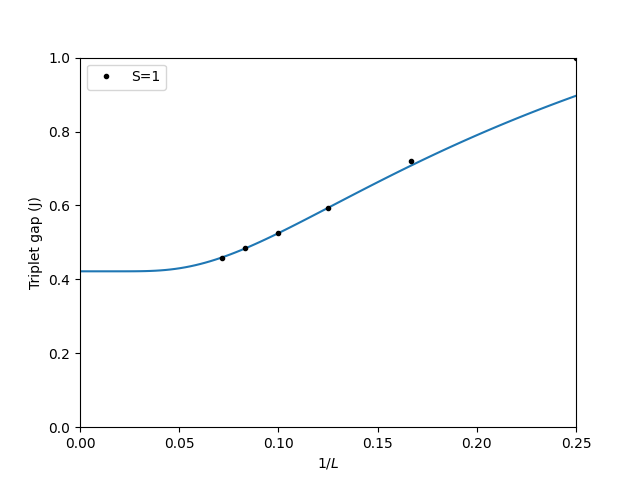

In this tutorial we will learn how to use the sparse diagonalization program (Lanczos algorithm) to calculate the energy gaps of a 1D spin-1 Heisenberg chain for various lattice sizes ($L=4, 6, 8$, and 10). The obtained finite-lattice gaps are then used to extrapolate the energy gap in the thermodynamic limit ($L=\infty$).

The Hamiltonian for the spin-1 Heisenberg chain is given by 
$$H = J\sum_{\langle i,j \rangle} \mathbf{S}^i \cdot \mathbf{S}^j$$,
where $J>0$ for antiferromagnetic interactions between two nearest-neighbour spins $\mathbf{S}^i$ and $\mathbf{S}^j$, and the spin-spin interaction consists of three components, i.e., 
$$\mathbf{S}^i \cdot \mathbf{S}^j=S^i_xS^j_x+S^i_yS^j_y+S^i_zS^j_z$$.

The basis states are usually chosen to be the eigen states of $S_z$ operator. For a spin-1 system, there are three basis states for each lattice site, $|-1\rangle$, $|0\rangle$, and $|+1\rangle$. The application of $S_x$ and $S_y$ operators on these basis states can be expressed in terms of raising $S^{\dagger}$ and lowering $S^{-}$ operators:
$$S_x=\frac{1}{2}(S^{\dagger}+S^{-})$$,
$$S_y=\frac{1}{2i}(S^{\dagger}-S^{-})$$, 
who act on the basis states in the following way:
$$S^{\dagger}|s\rangle = \sqrt{S(S+1)-s(s+1)}|s+1\rangle$$,
$$S^{-}|s\rangle = \sqrt{S(S+1)-s(s-1)}|s-1\rangle$$,
where $S=1/2$ and $s=-S, -S+1$.

With the above basis states for each lattice site, the Hamiltonian can be written as a Hermitian matrix. The size of the matrix can be reduced when the total magnetization is fixed, i.e., setting Sz_total = 0 (singlet sector) or Sz_total = 1 (triplet sector) in the simulations. 


We first import the required modules.


```python
import pyalps
import numpy as np
import matplotlib.pyplot as plt
import pyalps.plot
import pyalps.fit_wrapper as fw
```

Then we prepare the input files as a list of Python dictionaries.


```python
parms = []
for l in [4, 6, 8, 10, 12, 14]:
  for sz in [0, 1]:
      parms.append(
        { 
          'LATTICE'                   : "chain lattice", 
          'MODEL'                     : "spin",
          'local_S'                   : 1,
          'J'                         : 1,
          'L'                         : l,
          'CONSERVED_QUANTUMNUMBERS'  : 'Sz',
          'Sz_total'                  : sz
        }
      )

```

We write the input file and run the simulation.


```python
input_file = pyalps.writeInputFiles('parm2a',parms)
res = pyalps.runApplication('sparsediag',input_file) #, MPI=4)
```


We next load the spectra for each of the systems sizes and spin sectors:


```python
data = pyalps.loadSpectra(pyalps.getResultFiles(prefix='parm2a'))
```

To extract the gaps we need to write a few lines of Python, to set up a list of lengths and a Python dictionaries of the minimum energy in each (L,Sz) sector:


```python
lengths = []
min_energies = {}

for sim in data:
  l = int(sim[0].props['L'])
  if l not in lengths: lengths.append(l)
  sz = int(sim[0].props['Sz_total'])
  all_energies = []
  for sec in sim:
    all_energies += list(sec.y)
  min_energies[(l,sz)]= np.min(all_energies)
```

And finally we make a plot of the gap as a function of 1/L and then show the plot


```python
gapplot = pyalps.DataSet()
gapplot.x = 1./np.sort(lengths)
gapplot.y = [min_energies[(l,1)] -min_energies[(l,0)] for l in np.sort(lengths)]  
gapplot.props['xlabel']='$1/L$'
gapplot.props['ylabel']='Triplet gap (J)'
gapplot.props['label']='S=1'
gapplot.props['line']='.'

plt.figure()
pyalps.plot.plot(gapplot)
plt.legend()
plt.xlim(0,0.25)
plt.ylim(0,1.0)
```


We then fit the data in the range L=8 to L=14 to obtain the gap in the thermodynamic limit ($L\rightarrow \infty$ or $1/L\rightarrow 0$).


```python
pars = [fw.Parameter(0.411), fw.Parameter(1000), fw.Parameter(1)]
f = lambda self, x, p: p[0]()+p[1]()*np.exp(-x/p[2]())
fw.fit(None, f, pars, np.array(gapplot.y)[2:], np.sort(lengths)[2:])

x = np.linspace(0.0001, 1./min(lengths), 100)
plt.plot(x, f(None, 1/x, pars))

plt.show()
```

The result of the simulation is shown in the figure:

