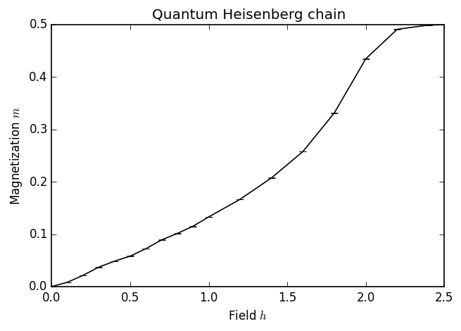
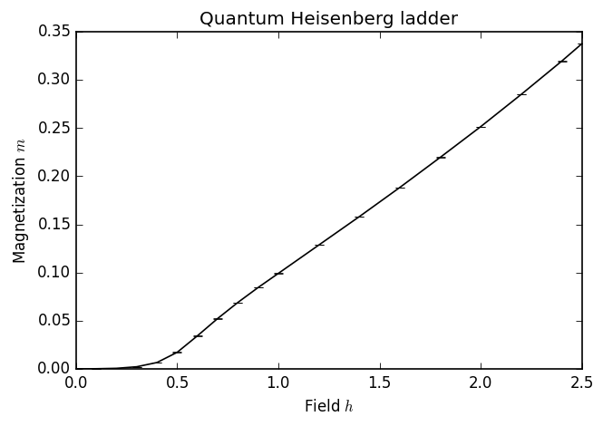
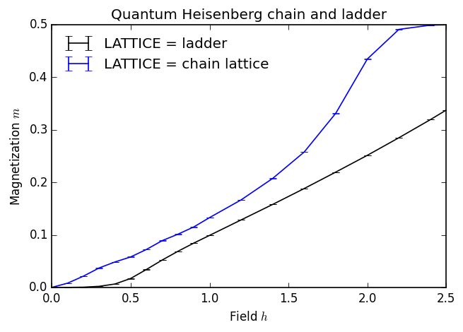

---
title: MC-09 Quantum Monte Carlo
math: true
toc: true
weight: 11
---

In [1]:

    import numpy as np
    matplotlib inline
    import matplotlib as mpl
    mpl.rc("savefig", dpi=120)
    import matplotlib.pyplot as plt

    import pyalps
    from pyalps.plot import plot

    /opt/local/Library/Frameworks/Python.framework/Versions/2.7/lib/python2.7/site-packages/matplotlib/__init__.py:1318: UserWarning:  This call to matplotlib.use() has no effect because the backend has already been chosen;
    matplotlib.use() must be called *before* pylab, matplotlib.pyplot,
    or matplotlib.backends is imported for the first time.

    warnings.warn(_use_error_msg)

## Heisenberg chain

In this first section, we calculate the magnetization curve of the  $S=1/2$  Heisenberg chain:
$$
H=\sum\_{i}^{L}\vec{S}\_i\cdot\vec{S}\_{i+1}+h\sum\_{i=1}^LS_i^z
$$
where we use periodic boundary conditions, i.e. we identify $\vec{S}\_{L+1}=\vec{S}\_1$.
We would like to calculate the magnetization curve in the ground state. However, our choice of method here is a path-integral Quantum Monte Carlo method that operates at finite temperature. We therefore simulate a thermal ensemble and choose a temperature that is sufficiently low compared to the other energy scales of the problem.

The thermal expectation value of the magnetization per site is defined as
$$
m=\frac{1}{L}\sum\_i\langle S\_i^z\rangle
$$
where
$$
\langle S_i^z\rangle = \frac{1}{Z}\text{Tr}(e^{-H/T}S_i^z).
$$
This is one of the standard observables calculated by the Directed Loop SSE implementation in ALPS.

### Parameter setup

The parameters we need to pass to the Directed Loop SSE code fall into four categories:

- Lattice parameters: We pick the lattice labeled "chain lattice". This corresponds to a simple one-dimensional chain with periodic boundary conditions. For this particular lattice, we also need to specify the length of the chain as the parameter "L".

- Model parameters: We pick the "spin" model and set  $S=1/2$ , which is achived by setting "local_S" to 1/2. The coupling is "J", and "h" is the magnetic field in the Z direction.

- Ensemble parameter: We here pick a temperature of  $T=0.08$ , which turns out to be low enough in this case to see the physical effect we're looking for.

- QMC parameters: For this simple setup, we pass only the number of sweeps in the thermalization part of the simulation ("THERMALIZATION"), and the number of sweeps for which we measure the desired observable ("SWEEPS").

**Suggestions:** 

- Explore how changing the temperature as well as the number of thermalization and measurement sweeps affects the results plotted below.

- Can you think of a guideline for choosing the temperature low enough to obtain ground-state physics?

In [14]:

    chain_parms = []
    for h in [0., 0.1, 0.2, 0.3, 0.4, 0.5, 0.6, 0.7, 0.8, 0.9, 1.0, 1.2, 1.4, 1.6, 1.8, 2.0, 2.2, 2.4, 2.5]:
        chain_parms.append({
            # lattice parameters
            'LATTICE'        : "chain lattice", 
            'L'              : 20,

            # model parameters
            'MODEL'          : "spin",
            'local_S'        : 0.5,
            'J'              : 1,
            'h'              : h,

            # ensemble parameter
            'T'              : 0.08,

            # QMC parameters
            'THERMALIZATION' : 1000,
            'SWEEPS'         : 5000,
        })
    chain_prefix = 'qmc_chain'

### Run the simulation

The simulation is performed using the directed loop SSE code, which is best suited to simulate a spin model (with a small number of states per site) in an external magnetic field.

In [16]:

    # Write the input files for the ALPS codes.
    # All the filenames will begin with the prefix chain_prefix='qmc_chain'.
    input_file = pyalps.writeInputFiles(chain_prefix, chain_parms)

    # The following command runs the applications.
    res = pyalps.runApplication('dirloop_sse',input_file,Tmin=5)

    dirloop_sse qmc_chain.in.xml --Tmin 5

### Analyze the results

For the data analysis, we rely on the methods available as part of the `pyalps` package, as well as the `matplotlib` library.

In [17]:

    # Load the raw measurement data. We only load the "Magnetization Density" and not all the other
    # quantities measured by the QMC code.
    data = pyalps.loadMeasurements(pyalps.getResultFiles(prefix=chain_prefix),'Magnetization Density')

    # The pyalps.collectXY function takes a set of data points and extracts plots
    # of the form "Y vs X".
    magnetization = pyalps.collectXY(data, x='h', y='Magnetization Density')

    plot(magnetization)
    plt.xlabel('Field $h$')
    plt.ylabel('Magnetization $m$')
    plt.title('Quantum Heisenberg chain')

Out[17]:
    

## Heisenberg ladder

We now solve the two-leg Heisenberg ladder in much the same way. The Hamiltonian for the ladder can be thought of as coupling two chains together. Denoting the spins in one chain $\vec{S}$  and in the other $\vec{T}$, the Hamiltonian is

$$
H=\sum\[J\_0(\vec{S}\_i\cdot\vec{S}\_{i+1}+\vec{T}\_i\cdot\vec{T}_{i+1})+J_1\vec{S}_i\cdot\vec{T}_i+h(S_i^z+T_i^z)\],
$$

where we again apply periodic boundary conditions with the identification $\vec{S}\_{L+1}=\vec{S}\_1$ and $\vec{T}\_{L+1}=\vec{T}\_1$.

Notice the difference in lattice and model parameters:

- In addition to the length of the system, we now also provide the width.
- The model now takes two parameters J0 and J1, where J0 is the coupling along the chains and J1 the coupling on the rungs. It is important to specify both parameters, otherwise they default to 0.

We keep all other parameters the same.

In [15]:

    ladder_parms = []
    for h in [0., 0.1, 0.2, 0.3, 0.4, 0.5, 0.6, 0.7, 0.8, 0.9, 1.0, 1.2, 1.4, 1.6, 1.8, 2.0, 2.2, 2.4, 2.5]:
        ladder_parms.append(
            { 
                # lattice parameters
                'LATTICE'        : "ladder", 
                'L'              : 20,
                'W'              : 2,
         
                # model parameters
                'MODEL'          : "spin",
                'local_S'        : 0.5,
                'J0'             : 1,
                'J1'             : 1,
                'h'              : h,
         
                # ensemble parameter
                'T'              : 0.08,
    
                # QMC parameters
                'THERMALIZATION' : 1000, # 1000
                'SWEEPS'         : 5000, # 20000
            }
        )
    ladder_prefix = 'qmc_ladder'
    
In [18]:

    input_file = pyalps.writeInputFiles(ladder_prefix, ladder_parms)
    res = pyalps.runApplication('dirloop_sse',input_file,Tmin=5)
    
    dirloop_sse qmc_ladder.in.xml --Tmin 5

In [19]:

    data = pyalps.loadMeasurements(pyalps.getResultFiles(prefix=ladder_prefix),'Magnetization Density')

    magnetization = pyalps.collectXY(data,x='h',y='Magnetization Density')

    plot(magnetization)
    plt.xlabel('Field $h$')
    plt.ylabel('Magnetization $m$')
    plt.title('Quantum Heisenberg ladder')

Out[19]: 

## Comparison

We now compare the results for the chain and the ladder. For this, we do not need to run any new simulations, but we simply load both sets of data at the same time and tell pyalps.collectXY to create a separate plot for each value of the LATTICE parameter.

- What are the significant differences between the two plots, particularly at small values of the field strength  h ?
- What is the physical interpretation of these differences? What is their origin in the spectrum of the system?

We will revisit these questions in the DMRG/MPS tutorial.

In [21]:

    data = pyalps.loadMeasurements(pyalps.getResultFiles(prefix=ladder_prefix),'Magnetization Density')
    data += pyalps.loadMeasurements(pyalps.getResultFiles(prefix=chain_prefix),'Magnetization Density')

    # We here use the fourth, optional, parameter of the collectXY function, allowing
    # us to pass a list of parameters such that collectXY creates a separate plot for
    # each value of the parameters.
    magnetization = pyalps.collectXY(data, 'h', 'Magnetization Density', ['LATTICE'])

    plot(magnetization)
    plt.xlabel('Field $h$')
    plt.ylabel('Magnetization $m$')
    plt.title('Quantum Heisenberg chain and ladder')
    plt.legend(loc=0, frameon=False)
    Out[21]: 

