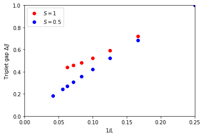

---
title: ED-02 Gaps
math: true
toc: true
---

## Spin gaps of 1D quantum spin systems

In this tutorial we will learn how to use the sparse diagonalization program using the Lanczos algorithm.

### Spin gap of a spin-1 chain

#### Using the command line
The parameter file <a href="../codes/ed-02-gaps/parm2a" download>`parm2a`</a> sets up exact diagonalization of the quantum mechanical S=1 chain with 4 to 10 sites in the singlet and triplet sector

    MODEL="spin"
    LATTICE="chain lattice"
    CONSERVED_QUANTUMNUMBERS="Sz"
    local_S=1
    J=1
    Sz_total=0
    {L=4}
    {L=6}
    {L=8}
    {L=10}
    Sz_total=1
    {L=4}
    {L=6}
    {L=8}
    {L=10}
    
The parameter Sz_total restricts the conserved quantum number Sz to the given value. See the model library documentation for more details on how to set up models and conserved quantum numbers.
Using the standard sequence of commands you can first convert the input parameters to XML and then run the application `sparsediag`:

    parameter2xml parm2a
    sparsediag --write-xml parm2a.in.xml
    
Evaluation of the gaps can now be done manually by looking at the output files, or we can use Python to automate the whole workflow.

#### Using Python
To set up and run the simulation in Python we use the script <a href="../codes/ed-02-gaps/tutorial2a.py" download>`tutorial2a.py`</a>. The first parts of this script imports the required modules, prepares the input files as a list of Python dictionaries, writes the input files and runs the application

    import pyalps
    import numpy as np
    import matplotlib.pyplot as plt
    import pyalps.pyplot
    parms = []
    for l in [4, 6, 8, 10]:
    for sz in [0, 1]:
        parms.append(
        { 
            'LATTICE'                   : "chain lattice", 
            'MODEL'                     : "spin",
            'local_S'                   : 1,
            'J'                         : 1,
            'L'                         : l,
            'CONSERVED_QUANTUMNUMBERS'  : 'Sz',
            'Sz_total'                  : sz
        }
     )
     
    input_file = pyalps.writeInputFiles('parm2a',parms)
    res = pyalps.runApplication('sparsediag',input_file)
    
To run this, launch your python interpreter using the convenience scripts `alpspython`. We now have the same output files as in the command line version.
We next load the spectra for each of the systems sizes and spin sectors:

    data = pyalps.loadSpectra(pyalps.getResultFiles(prefix='parm2a'))
    
To extract the gaps we need to write a few lines of Python, to set up a list of lengths and a Python dictionaries of the minimum energy in each (L,Sz) sector:

    lengths = []
    min_energies = {}
    for sim in data:
        l = int(sim[0].props['L'])
        if l not in lengths: lengths.append(l)
        sz = int(sim[0].props['Sz_total'])
        all_energies = []
        for sec in sim:
            all_energies += list(sec.y)
        min_energies[(l,sz)]= np.min(all_energies)
 
And finally we make a plot of the gap as a function of 1/L and then show the plot
    
    gapplot = pyalps.DataSet()
    gapplot.x = 1./np.sort(lengths)
    gapplot.y = [min_energies[(l,1)] -min_energies[(l,0)] for l in np.sort(lengths)]  
    gapplot.props['xlabel']='$1/L$'
    gapplot.props['ylabel']='Triplet gap $\Delta/J$'
    gapplot.props['label']='S=1'

    plt.figure()
    pyalps.plot.plot(gapplot)
    plt.legend()
    plt.xlim(0,0.25)
    plt.ylim(0,1.0)
    plt.show()

## Spin gap of a spin-1/2 chain

Compare the extrapolated gap of the spin-1 chain to that of a spin-1/2 chain. To do so, just change the local spin local_S=1 to local_S=0.5 and run the simulations (but give them the name `parm2b`). The parameter file is <a href="../codes/ed-02-gaps/parm2b" download>`parm2b`</a> and the Python script <a href="../codes/ed-02-gaps/tutorial2b.py" download>`tutorial2b.py`</a>.

## Both systems in one plot                                                     

To show both gaps in one plot run the Python script <a href="../codes/ed-02-gaps/tutorial2c.py" download>`tutorial2c.py`</a> after running the first two tutorials.
The gaps as a function of lattice size for both spin 1/2 and 1 are plotted in the following figure:

## Questions

- What is the extrapolated value of the gap for an infinite system?
- Why do the S=1/2 and S=1 chains show different behavior?
